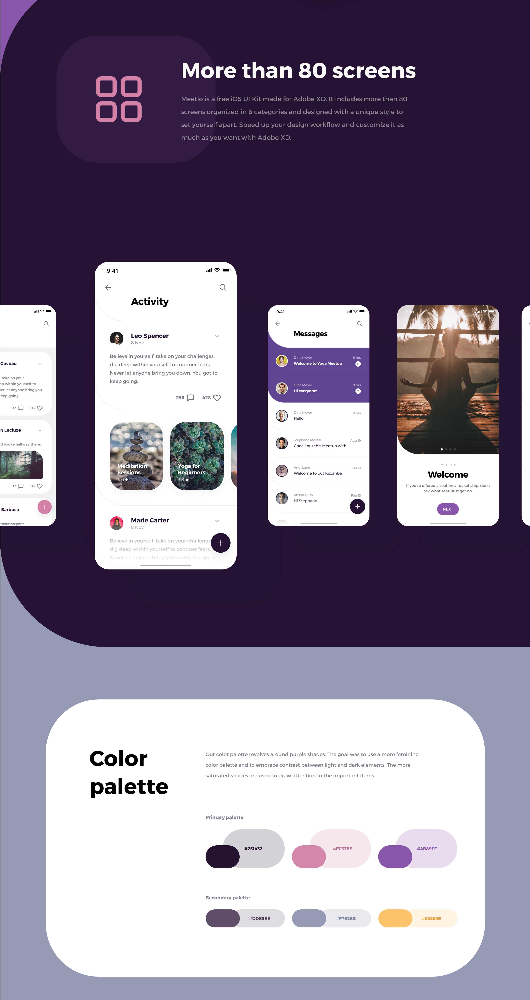
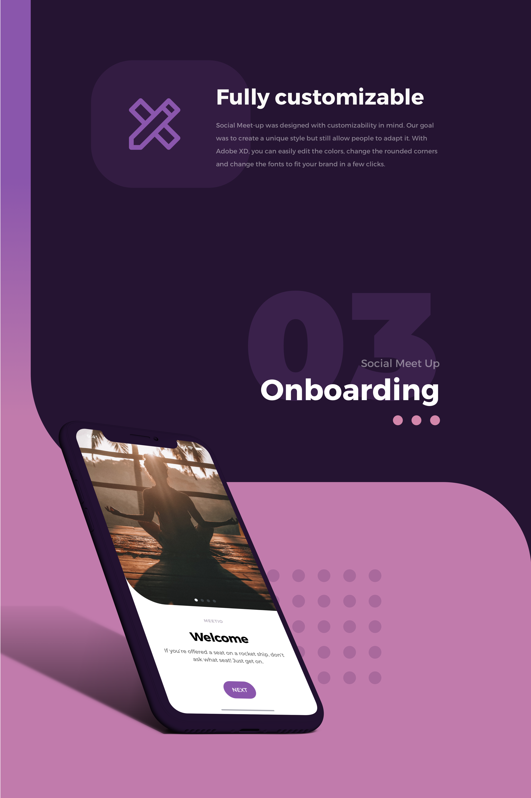
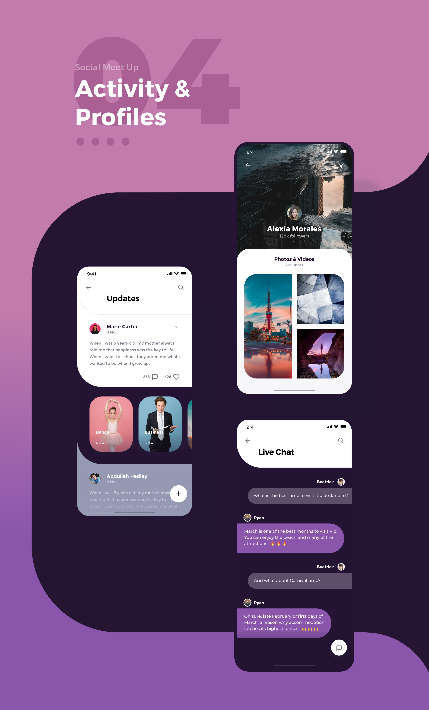

# REACT NATIVE MEETIO

***still in development***

Are you in need of a high quality production ready template for your next project…
look no further, check out react-native-meetio,
A free UI Kit built in react native to speed up your workflow and get your app ready for market in no time...

Boost your productivity and cut down time to market in half by using this ui kit implemented using expo and known best practices in the industry.
You can also draw inspiration & ideas from it for your next project or it could serve as a learning resource for building high quality react native apps.

### SETUP

- clone the project
    ```
    git clone https://github.com/AndyOsei/react-native-meetio
    ```
- install dependencies and run app
    ```
    yarn install
    expo start
    ```
- Choose any of the options to either run on Android / IOS


### BUILT WITH
- Expo
- React Navigation v5
- Shopify/restyle
- React Native Reanimated
- React Native Redash

### Contributing
If you face an issue or have any contributions, you can open an issue or reach out to me at @andyosei36@gmail.com. Do follow me on [twitter](https://twitter.com/andyosei36).
Am also available for consulting and helping you build your next amazing product / app.








Find actual design on [behance](https://www.behance.net/gallery/81858385/Foodybite-Free-UI-Kit-for-Adobe-XD).
Designed by [Aurelien Salomon](https://www.behance.net/aureliensalomon) [Lindsay Munro](https://www.behance.net/lindsaymun78e5)... Thanks guys for such an amazing design.

### License

MIT, see [LICENSE.md](https://https://github.com/AndyOsei/react-native-meetio/blob/master/LICENSE.md) for details.